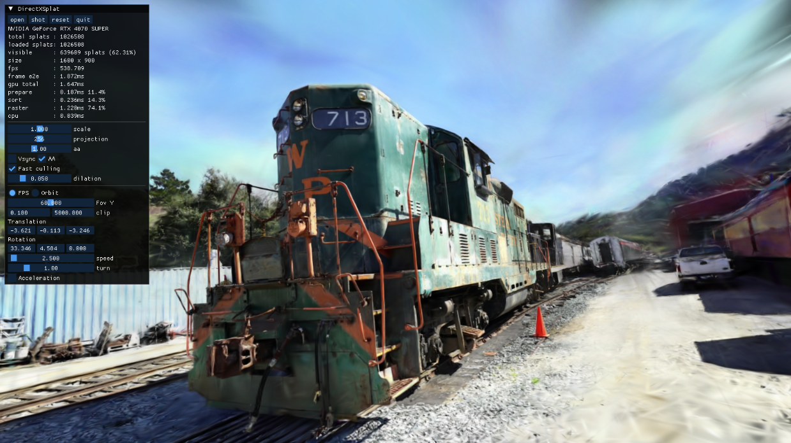

# DirectXSplat

[](LICENSE)

A C++/Direct3D 12 library for rendering 3D Gaussian Splats in D3D12.



This is a C++/Direct3D 12 library for rendering scenes captured via the techniques described in [3D Gaussian Splatting for Real-Time Radiance Field Rendering](https://repo-sam.inria.fr/fungraph/3d-gaussian-splatting/). It lets you load PLY, SPZ, `.splat`, SOG, and LOD metadata scenes and render them from a host D3D12 application.

Modules include:

- `directxsplat`, the core library for loading scenes, uploading splats, managing residency, sorting, and rendering a frame.
- `shaders`, the HLSL compute/raster shader code used by the renderer.
- `appcommon`, shared D3D12/Win32 helper code used by the examples and tests; not required for embedding the core library.
- `examples/imgui_viewer`, the interactive sample app for opening scenes and inspecting renderer stats.
- `examples/minimal_viewer`, a smaller windowed integration example without the full viewer UI.
- `examples/offscreen_capture`, a small example for rendering a scene to an image.
- `examples/scene_updates`, `examples/gpu_resource_interop`, and `examples/external_d3d12_integration`, focused examples for the public mutation, resource lease, and host-D3D12 integration APIs.

## Quick Start

```powershell
cmake -S . -B build -G "Visual Studio 17 2022" -A x64 `
  -DDXSPLAT_BUILD_SAMPLE=ON `
  -DDXSPLAT_BUILD_TESTS=ON

cmake --build build --config Release
ctest --test-dir build -C Release --output-on-failure
```

Run the ImGui viewer:

```powershell
.\build\bin\Release\DirectXSplatImGuiViewer.exe "C:\path\to\point_cloud.ply"
```

Build only the library:

```powershell
cmake -S . -B build-lib -G "Visual Studio 17 2022" -A x64 `
  -DDXSPLAT_BUILD_SAMPLE=OFF `
  -DDXSPLAT_BUILD_TESTS=OFF

cmake --build build-lib --config Release --target dxsplat
```

## Use From CMake

Install:

```powershell
cmake -S . -B build-install -G "Visual Studio 17 2022" -A x64 `
  -DDXSPLAT_BUILD_SAMPLE=OFF `
  -DDXSPLAT_BUILD_TESTS=OFF `
  -DCMAKE_INSTALL_PREFIX="$PWD\install"

cmake --build build-install --config Release --target install
```

Consume:

```cmake
find_package(DirectXSplat CONFIG REQUIRED)

add_executable(my_app main.cpp)
target_link_libraries(my_app PRIVATE DirectXSplat::DirectXSplat)
target_compile_features(my_app PRIVATE cxx_std_20)
```

As a subproject, examples and tests are off by default:

```cmake
add_subdirectory(external/dxsplat)
target_link_libraries(my_app PRIVATE DirectXSplat::DirectXSplat)
```

## Minimal Integration

DirectXSplat does not own your swapchain or frame loop. You provide the D3D12 device, direct queue, command list, and submission fence.

```cpp
#include "dxsplat/context.h"
#include "dxsplat/io.h"
#include "dxsplat/renderer.h"

dxsplat::D3D12Context context;
dxsplat::Status status = context.Initialize(device, directQueue, directFence);
if (!status.ok) return status;

dxsplat::Renderer renderer;
status = renderer.Initialize(context);
if (!status.ok) return status;

dxsplat::StatusOr<dxsplat::Scene> loaded = dxsplat::LoadSceneFromFile(scenePath);
if (!loaded.ok()) return loaded.status;

dxsplat::UploadedSceneHandle sceneHandle;
status = renderer.CreateUploadedScene(loaded.value, sceneHandle);
if (!status.ok) return status;
```

Per frame:

```cpp
dxsplat::RenderInput input{};
input.view = view;
input.proj = proj;
input.cameraPosition = cameraPosition;
input.viewportWidth = width;
input.viewportHeight = height;
input.nearPlane = 0.1f;
input.farPlane = 5000.0f;
input.frameIndex = frameIndex;
input.settings.antialiasing = true;
input.settings.fastCulling = true;

dxsplat::RenderTargetBinding target{};
target.colorTarget = backBuffer;
target.colorRtv = rtv;
target.colorFormat = DXGI_FORMAT_R8G8B8A8_UNORM;
target.colorStateBefore = D3D12_RESOURCE_STATE_PRESENT;
target.colorStateAfter = D3D12_RESOURCE_STATE_PRESENT;
target.viewport = viewport;
target.scissor = scissor;

dxsplat::RenderFrameContext frameContext{};
frameContext.fence = directFence;
frameContext.completedFenceValue = directFence->GetCompletedValue();
frameContext.submissionFenceValue = fenceValueYouWillSignalAfterExecute;
frameContext.frameIndex = frameIndex;

dxsplat::RenderPreparationResult preparation{};
status = renderer.PrepareSceneForRender(sceneHandle, input, frameContext, &preparation);
if (!status.ok) return status;

dxsplat::RenderResult result{};
status = renderer.Render(commandList, target, sceneHandle, input, frameContext, result);
if (!status.ok && !result.submission.submissionRequired) return status;

if (result.submission.uploadSyncPoint.IsValid()) {
  directQueue->Wait(result.submission.uploadSyncPoint.fence, result.submission.uploadSyncPoint.value);
}

directQueue->ExecuteCommandLists(1, &commandList);
directQueue->Signal(directFence, frameContext.submissionFenceValue);

if (!status.ok) return status;
```

## Frame Submission Contract

`RenderFrameContext` is required for rendering. DirectXSplat records into your command list and uses the frame context to track when renderer-owned GPU resources can be reused or released.

Required fields:

- `frameContext.fence` must be the same direct-queue fence passed through `D3D12Context`.
- `submissionFenceValue` must be a future value, not an already completed value.
- If `RenderResult::submission.uploadSyncPoint` is valid, make the direct queue wait on it before executing the command list.
- If `Render` returns an error with `submissionRequired == true`, command-list work may already be recorded. Submit/signal it or enter device-lost cleanup.
- If queue execution or signaling fails after renderer work was recorded, call `renderer.NotifyDeviceLost()` before shutdown.

## Renderer Configuration

```cpp
dxsplat::RendererConfig config{};
config.residencyBudgetGaussians = 16ull * 1024ull * 1024ull;
config.uploadBudgetGaussians = 650000;
config.warmUploadBudgetGaussians = 1200000;
config.maxUploadsPerFrame = 16;
config.chunkTargetSize = 65536;
config.lod0ScreenRadius = 72.0f;
config.lod1ScreenRadius = 24.0f;
config.cullScreenRadius = 0.35f;
config.residencyCacheFrames = 120;
config.enableGpuTiming = true;

renderer.Initialize(context, config);
```

Most apps can start with defaults.

## Scene Updates

Whole scene:

```cpp
renderer.UpdateUploadedScene(sceneHandle, newScene);
```

Chunk mutation:

```cpp
dxsplat::SceneMutationToken token;
renderer.BeginSceneMutation(sceneHandle, token);
renderer.AddUploadedChunk(token, gaussianSet, outChunkHandle);
renderer.EndSceneMutation(token);
```

Available chunk operations:

- `AddUploadedChunk`
- `UpdateUploadedChunk`
- `RemoveUploadedChunk`
- `SetUploadedChunkEnabled`
- `SetUploadedChunkScalingModifier`
- `GetUploadedSceneChunks`
- `GetUploadedChunkInfo`

## GPU Resource Interop

```cpp
dxsplat::UploadedSceneGpuResources resources{};
status = renderer.AcquireUploadedSceneGpuResources(sceneHandle, frameContext, resources);
if (!status.ok) return status;

if (resources.submission.uploadSyncPoint.IsValid()) {
  directQueue->Wait(resources.submission.uploadSyncPoint.fence, resources.submission.uploadSyncPoint.value);
}

directQueue->Signal(resources.leaseFence, resources.leaseFenceValue);
```

Returned resources are renderer-owned. Respect `callerMayTransition`, and do not cache raw resource pointers beyond the lease.
Use `GetUploadedSceneGpuResources` only for a non-leasing snapshot; use `AcquireUploadedSceneGpuResources` before recording external GPU work that references the returned resources.

## Examples

| Target | Executable | Purpose |
|---|---|---|
| `imgui_viewer` | `DirectXSplatImGuiViewer.exe` | Interactive viewer. |
| `minimal_viewer` | `DirectXSplatMinimalViewer.exe` | Small windowed integration example. |
| `offscreen_capture` | `DirectXSplatOffscreenCapture.exe` | Render one image to PPM. |
| `external_d3d12_integration` | `DirectXSplatExternalD3D12Integration.exe` | Host-owned D3D12 setup. |
| `scene_updates` | `DirectXSplatSceneUpdates.exe` | Scene/chunk mutation. |
| `gpu_resource_interop` | `DirectXSplatGpuResourceInterop.exe` | Resource lease/export. |

## Build Options

| Option | Default | Description |
|---|---:|---|
| `DXSPLAT_BUILD_SAMPLE` | `ON` top-level, `OFF` as subproject | Build examples. |
| `DXSPLAT_BUILD_TESTS` | `ON` top-level, `OFF` as subproject | Build tests. |
| `DXSPLAT_ENABLE_GPU_TESTS` | `ON` | Enable renderer GPU tests when supported. |
| `DXSPLAT_ENABLE_WARNINGS` | `ON` | Enable warning flags. |
| `DXSPLAT_WARNINGS_AS_ERRORS` | `OFF` | Treat warnings as errors. |

## CI Coverage

CI builds the library, examples, CPU tests, loader/security regressions, layout invariants, and install/export smoke tests.

Hosted CI does not fully validate the hardware D3D12 renderer path. Run GPU tests on a local D3D12 machine before release.

## License

DirectXSplat is licensed under the [MIT License](LICENSE), copyright (c) 2026 pbkx.

## 3rd-Party Licenses

| Library | URL | License |
|--------------|---------|--|
| **Microsoft D3DX12 helper headers** | https://github.com/microsoft/DirectX-Headers | [MIT](https://github.com/microsoft/DirectX-Headers/blob/main/LICENSE) |
| **ghc::filesystem** | https://github.com/gulrak/filesystem | [MIT](https://github.com/gulrak/filesystem/blob/master/LICENSE) |
| **miniz** | https://github.com/richgel999/miniz | [Unlicense / Public Domain](https://github.com/richgel999/miniz/blob/master/LICENSE) |
| **stb_image** | https://github.com/nothings/stb | [MIT or Public Domain](https://github.com/nothings/stb/blob/master/LICENSE) |
| **GPUSorting** | https://github.com/b0nes164/GPUSorting | [MIT](3rdparty/GPUSorting/LICENSE) |

The bundled GPUSorting package also includes notices for incorporated third-party components:

| Project | URL | License |
|--------------|---------|--|
| **FidelityFX SDK** | https://github.com/GPUOpen-LibrariesAndSDKs/FidelityFX-SDK | [MIT](3rdparty/GPUSorting/LICENSE) |
| **CUB** | https://github.com/NVIDIA/cub | [BSD 3-Clause](3rdparty/GPUSorting/LICENSE) |
| **DirectStorage** | https://github.com/microsoft/DirectStorage | [MIT](3rdparty/GPUSorting/LICENSE) |
| **bb_segsort** | https://github.com/vtsynergy/bb_segsort | [LGPL 2.1](3rdparty/GPUSorting/LICENSE) |

Additional dependencies fetched by CMake:

| Library | URL | License |
|--------------|---------|--|
| **nlohmann/json** | https://github.com/nlohmann/json | [MIT](https://github.com/nlohmann/json/blob/develop/LICENSE.MIT) |
| **Dear ImGui** | https://github.com/ocornut/imgui | [MIT](https://github.com/ocornut/imgui/blob/master/LICENSE.txt) |
| **doctest** | https://github.com/doctest/doctest | [MIT](https://github.com/doctest/doctest/blob/master/LICENSE.txt) |
